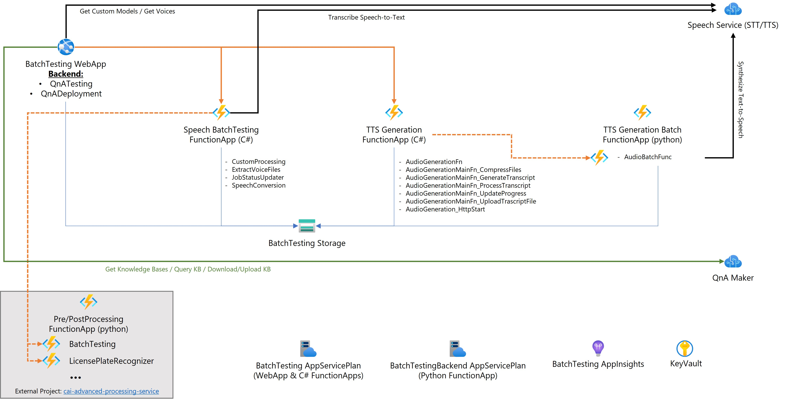

# Conversational AI Test & Training Tool

This Solution Accelerator provides a Web Application which supports testing and training processes for Cognitive Services Models based on a graphical user interface.

The following features are currently implemented:
- QnA Maker
  - Batch Testing of QnA Maker Knowledge Bases
  - Deployment of QnA Maker Knowledge Bases to a production environment incl. Testing
- Speech Service
  - Batch Testing of Baseline and Custom Speech Models
  - End-2-End Batch Testing of Speech Models in Combination with License Plate Recognition post processing (see project [Conversational AI Advanced Processing Service](https://github.com/microsoft/cai-advanced-processing-service))
  - Batch Text-to-Speech Audio Content Creation

Currently open:
- Extensions to support further Speech Service End-2-End Batch Testing sceanrios in combination with furter [Conversational AI Advanced Processing Service](https://github.com/microsoft/
cai-advanced-processing-service)
- Support for new Language Service Custom QnA (new QnA Maker service)

## High Level Architecture
The following image provides an overview of the Architecture of the tool.



The tool consists of the following Key components:
1. Web Application hosting the graphical user interface front- and back-end incl. orchestrating processes for QnA Maker
2. Backend Function Apps orchestrating processes for Speech and Post Processing Service

Currently open:
- Consolidation of TTS Generation Functions Apps

## Deployoment of the solution

### Setting up the required Azure services

The following services are required to run the solution:
| Service Name | Description | Settings |
|--------------|------------|------------|
| **Supporting Services** |||
| Key vault | Key Vault to store all secret credentials ||
| QnA Maker | For testing of QnA Maker Deployment create two QnA Maker Services ||
| Speech Service | Azure Speech Service incl. your project and custom models | SKU S1 |
| Storage account | Storage Account to use with Function Apps and for storage of application data and queues | Depending on your preference create separate services per webapp app/function app or one consolidated one; General Purpose v1 or v1 Standard |
| **Main Application / Front-End & .net Function Apps** |||
| Main Web App | WebApp Service| Windows Based webapp|
| App Service plan | App Service Plan for Main Application and .net-based backend Function Apps | Windows-based default SKU S1 |
| Application Insights | Logging for Main Application and Function Apps | Depending on your preference create separate services per webapp app/function app or one consolidated one |
| Audio Generation Function App | Function App | Windows based, durable Function |
| Speech Batchtesting Function App | Function App | Windows based, durable Function |
| **Linux Function Apps** |||
| App Service plan | App Service Plan for Python based Function App; this Function still needs to be migrated to .net and then can be integrated into *Audio Generation Function App* | Linux-based default SKU S1 |
| Audio Geeration Funciton App | Function App | Linux based |

- Configure System Managed Identities and grant read access to KeyVault for each of the services

**INFO:** To use the License Plate Recognition Batch Testing you need to have a deployed setup of the Advance Processing Service. See [CAI Advanced Processing Service (github)](https://github.com/microsoft/cai-advanced-processing-service) for more information on this services.

### Main Application (Web Application)

#### Run the application


To run the main application the following software must be installed:
- Node.js = 14.x
- yarn

On the `/webapp` folder run the follwoing commands in sequence:
```
yarn install
yarn build
yarn start
```

`yarn install` will ensure all required dependencies are fetched from npm.

`yarn build` will compile both server and client source codes.

`yarn start` starts the application in Production mode. `yarn start:dev` starts the application in the Development mode (no need for managed identities)

__Note:__ When running locally you can also use `yarn start:dev`. This target will start the application in Development mode (i.e. the NODE_ENV variable is set to development). The code is prepared to read the environment variables from an .env file when running in Development mode.

The application is running once the following output is seen in the console (or similar):

```
Conversational AI Test and Training Tool now running at:

http://localhost:3000
```


#### Setting Application Settings

For the app to run there is a set of settings that need to be provided as environment variables. Locally it is recomended that these variables can be set locally using a .env file that should not be commited in a repo.
When deploying the code in an Azure Web App these variables can be set up directly in the Web App instance Configuration pane as seen in the figure below.


The required settings for the running the app are the following:
| Setting Name | Description |
|--------------| ------------|
|SA_CONNECTION_STRING | Storage account connection string |
|**QNA_ACCESS_KEY_UAT** | QNA Maker Subscription Key |
|API_KNOWLEDGE_BASE | URL to the QnaMaker| 
|TENANTID | ID of the Active Directory Tennat|
|CLIENTID | Client ID of the App Registration used for authentication|
|REDIRECT_URL | Redirect URL used on the authentication flow. Should be in the format "https://\<hostname\>/auth/aad/callback"|
|CLIENT_SECRET | Client Secret of the App Registration used for user authentication|
|SPEECH_SERVICE_KEY | Subscription Key for Speech Service|
|SPEECH_SERVICE_REGION | Region of the Speech Service|
|COGNITIVE_SERVICE_HOST | Host URL of the Azure Cognitive Service e.g. "https://westus.api.cognitive.microsoft.com/qnamaker/v4.0"
|QNA_ENV | Names of Environments you are using for the QnA Maker Testing as array: e.g. ["TEST", "DEV"] |
|QNA_KEY | Connection keys for the enironments defined for QNA_ENV as array: e.g. ["<key_for_TEST>", "<key_for_DEB>"] |
|QNA_URL | Connection URLs for the enironments defined for QNA_ENV as array: e.g. ["https://<TEST>.azurewebsites.net", "https://<DEV>.azurewebsites.net"] |
|QNA_PROD_KEY | Connection key for the production environment used in the QnA Maker Deploymwent: "<key_for_PROD>" |
|QNA_PROD_URL | Connection url for the production environment used in the QnA Maker Deploymwent: "https://<PROD>.azurewebsites.net" |
|QNA_PRD_DEPLOYMENT_TEST_COVERAGE_IN_PERCENT | Percentage of test cases that will be tested in the production environment: e.g. "50" |


#### Multilanguge support
The frontend application has supports localization through the usage of the i18n library (more information available on the [i18n library official website](https://www.i18next.com/)). 

Each language has its own json file that defines the texts that appear in the lables. Those json files are stored in the public folder of the webapp as can be seen in the image below:


To add a new language to the tool the following steps need to be performed:
1. Create a new folder inside `webapp/public/locales`for the new language file. The name of the new folder should match the name of the language you are adding. (e.g. If adding Spanish, the folder should be named `es`).

2. Inside the newly created folder add a `translation.json` file. To ensure that no label is missed, copy the translation.json from another language such as `en` or `de`.

3. Add the new langauge in the list of allowed languages for the app. On the `/webapp/client/src/i18nextConf.js` file, append the language to the whitelist array.
 ```javascript
.init({
    debug: true,

    whitelist: ['en','de', 'ADD HERE NEW LANGUAGE'],

    fallbackLng: 'en',

 ```

#### Deployment to Azure

The application is built on the React framework, therefore it can be deployed in a multitude of platforms.
The development team of this tool used the following platform:
  - App Service on Azure
  - .NET Stack
  - .NET Version = V4.8
  - WEBSITE_NODE_DEFAULT_VERSION (config settings) - ~14
  
 Although we never tried, this app should be able to be deployed as a container in Docker.  

### Backend Functions

#### Speech Batch Testing Function (BatchTestingTools/BatchTesting.Tool.Function)
The batch testing function depends on Azure storage account. This function uses tables, blobs and queues from the storage account.

**Creating Storage Account:**
The following steps needs to be performed:
1. Create a storage account in your subscription.
2. Add constainer with the name `voices` in the storage account's blob.
3. Create two tables in the storage account's tables with the names `BatchJobs` and `BatchJobDetails`.
4. Create three queues in the storage account's queues with the names `Customprocessingtasks`, `Speechtasks` and `voicesfilestasks`.

**Creating Azure Function**
1. Create Azure Function, App Service Plan and Windows based.
2. Switch On `Always On` feature. 

##### Code Deployment

1. Open your PowerShell
1. Activate your environment, if you haven't before: <br>
`source .venv/bin/activate` (Linux) or `.venv/Scripts/activate` (Windows)
1. Login to your Azure Account: `az login` (a browser window will open, where you may have to log on Azure)
1. Execute the command below:<br> 
`func azure functionapp publish [insert your function name] --remote build`
1. Wait until the deployment is finished
1. (optional, only has to be done for initial deployment OR when settings are updated) Execute following command:<br>
`az webapp config appsettings set -g [insert name of resource group] -n [insert your function name] --settings @appsettings.json`

##### Setting Application Settings

The required settings for the running the app are the following:
| Setting Name | Description |
|--------------| ------------|
| AzureWebJobsStorage | Storage account connection string |
| TableStorageConnectionString | Queues storage account connection string, If you are following the steps in this document you will have one storage account |
| BatchJobTableName | This is the batch job table name. If you are using the table names listed in this document, then set this to `BatchJobs` |
| BatchJobDetailsTableName | This is the batch job table name. If you are using the table names listed in this document, then set this to `BatchJobDetails` |
| SpeechSubscriptionKey | This is the key for the speech subscription created earlier |
| region | This is the speech subscribtion region, for example westeurope |
| LPRCPLFunctionURL | This is the URL for the LPR function, the URL should be in the format "https://\<The LPR function URL\>/api/LicensePlateRecognizer" |
| LPRCPLFunctionKey | The LPR Function code |
| WERFunctionURL | This is the URL for the WER function, the URL should be in the format "https://\<The WER function URL\>/api/BatchTesting"|
| WERFunctionKey | The WER Function code |

See [webapp.appsettings.json.sample](./BatchTestingTools/BatchTesting.Tool.Function/webapp.appsettings.json.sample) for details.

#### TTS Generation Function (BatchTestingTools/AudioGeneration.Tool.Function)

**Creating Storage Account:**
The following steps needs to be performed:
1. Create a storage account in your subscription. (Can be shared with the other functions.)
2. Add constainer with the name `audiogeneration` in the storage account's blob.
3. Create two tables in the storage account's tables with the names `AudioGenerationJobs` and `AudioGenerationJobDetails`.

**Creating Azure Function**
1. Create Azure Function, App Service Plan and Windows based.
2. Switch On `Always On` feature. 

##### Code Deployment

1. Open your PowerShell
1. Activate your environment, if you haven't before: <br>
`source .venv/bin/activate` (Linux) or `.venv/Scripts/activate` (Windows)
1. Login to your Azure Account: `az login` (a browser window will open, where you may have to log on Azure)
1. Execute the command below:<br> 
`func azure functionapp publish [insert your function name] --remote build`
1. Wait until the deployment is finished
1. (optional, only has to be done for initial deployment OR when settings are updated) Execute following command:<br>
`az webapp config appsettings set -g [insert name of resource group] -n [insert your function name] --settings @appsettings.json`

##### Setting Application Settings

The required settings for the running the app are the following:
| Setting Name | Description |
|--------------| ------------|
| AudioFunctionApiConfiguration:BaseUrl | The base URL of the Audio Generation Function |
| AudioFunctionApiConfiguration:Api | The API path for the Audio Generation Function. By Default the value is `api/audiobatchfunc` |
| AudioFunctionApiConfiguration:Key| The Security API Key for the Audio Generation Function. It is recommended to store the key in a key vault and refer to it here|
| ConnectionStrings:SaveStorageConnectionString| Storage account connection string. This is the connection string for the storage accout that is used by the TTS Generation Batch Function were the TTS functions output will be stored |
| ContainerName| The name of the container that the TTS Generation Batch Function push the output to. By Defauls the value is `batchsynth` |
| AzureWebJobsStorage| Storage account connection string. This is the connection string for the storage account that has the Audio Generation Tables and blob storage |
| ConnectionStrings:TableStorageConnectionString| Storage account connection string. This is the connection string for the storage account that has the Audio Generation Tables and blob storage|

See [webapp.appsettings.json.sample](./BatchTestingTools/AudioGeneration.Tool.Function/webapp.appsettings.json.sample) for details.

#### TTS Generation Batch Function (BatchTestingTools/AudioGenerationPython.Tool.Function)
*Info: This is currently still a separate pyhton Function which should be refactored into the **AudioGeneration.Tool.Function** going forward.*

**Creating Storage Account:**
The following steps needs to be performed:
1. Create a storage account in your subscription. (Can be shared with **AudioGeneration.Tool.Function**.)
2. Add constainer with the name `batchsynth` in the storage account's blob.
3. Create two tables in the storage account's tables with the names `funccaiaudiogenerationHistory` and `funccaiaudiogenerationInstances`.

**Creating Azure Function**
1. Create Azure Function, App Service Plan and Linux based.
2. Switch On `Always On` feature.

##### Code Deployment

1. Open your PowerShell
1. Activate your environment, if you haven't before: <br>
`source .venv/bin/activate` (Linux) or `.venv/Scripts/activate` (Windows)
1. Login to your Azure Account: `az login` (a browser window will open, where you may have to log on Azure)
1. Execute the command below:<br> 
`func azure functionapp publish [insert your function name] --remote build`
1. Wait until the deployment is finished
1. (optional, only has to be done for initial deployment OR when settings are updated) Execute following command:<br>
`az webapp config appsettings set -g [insert name of resource group] -n [insert your function name] --settings @appsettings.json`

##### Setting Application Settings

The required settings for the running the app are the following:
| Setting Name | Description |
|--------------| ------------|
| AzureWebJobsStorage | Storage account connection string |
| APPINSIGHTS_INSTRUMENTATIONKEY | Application Insights Instrumentation Key|
| APPLICATIONINSIGHTS_CONNECTION_STRING | Application Insights Connection String |
| AZURE_BLOB | Storage Connection String for the Blob Storage Used |
| AZURE_BLOB_CONTAINER | Azure Blob Container name to use for Audiogeneration. E.g. "batchsynth" |
| COGNITIVE_NAME | Microsoft Speech Service Name |
| COGNITIVE_REGION | Microsoft Speech Service Region |
| COGNITIVE_KEY | Microsoft Speech Service Subscription Key |
| AWS_ACCESS | AWS Speech Service Access setting|
| AWS_ACCESS_SECRET | AWS Speech Service Secret|
| AWS_REGION | AWS Speech Service Region |
| GOOGLE_APPLICATION_CREDENTIALS_STORE COGNITIVE_KEY | Google Speech Service Credentials Store Key |
| AzureWebJobs.BatchTesting.Disabled | Setting to control wether Batchtesting is disabled; set to "1" |
| AzureWebJobs.LicensePlate.Disabled | Setting to control wether Batchtesting is disabled; set to "1" |

See [webapp.appsettings.json.sample](./BatchTestingTools/AudioGenerationPython.Tool.Function/webapp.appsettings.json.sample) for details.

## Usage of Tool

To get guidance on the usage of the Tool read the [User Guide](UserGuide.md).

## Contributing

This project welcomes contributions and suggestions.  Most contributions require you to agree to a
Contributor License Agreement (CLA) declaring that you have the right to, and actually do, grant us
the rights to use your contribution. For details, visit https://cla.opensource.microsoft.com.

When you submit a pull request, a CLA bot will automatically determine whether you need to provide
a CLA and decorate the PR appropriately (e.g., status check, comment). Simply follow the instructions
provided by the bot. You will only need to do this once across all repos using our CLA.

This project has adopted the [Microsoft Open Source Code of Conduct](https://opensource.microsoft.com/codeofconduct/).
For more information see the [Code of Conduct FAQ](https://opensource.microsoft.com/codeofconduct/faq/) or
contact [opencode@microsoft.com](mailto:opencode@microsoft.com) with any additional questions or comments.

## Trademarks

This project may contain trademarks or logos for projects, products, or services. Authorized use of Microsoft 
trademarks or logos is subject to and must follow 
[Microsoft's Trademark & Brand Guidelines](https://www.microsoft.com/en-us/legal/intellectualproperty/trademarks/usage/general).
Use of Microsoft trademarks or logos in modified versions of this project must not cause confusion or imply Microsoft sponsorship.
Any use of third-party trademarks or logos are subject to those third-party's policies.
