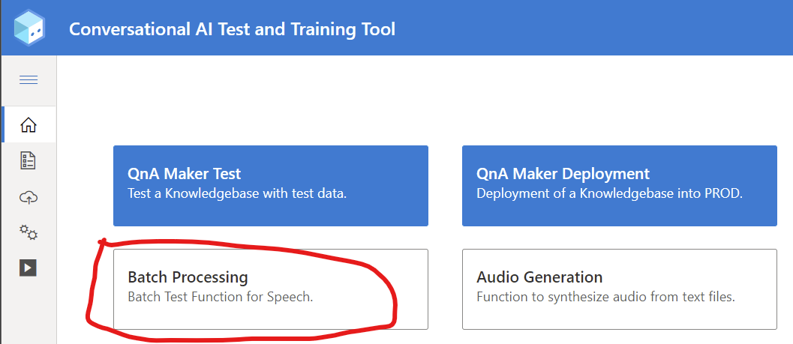
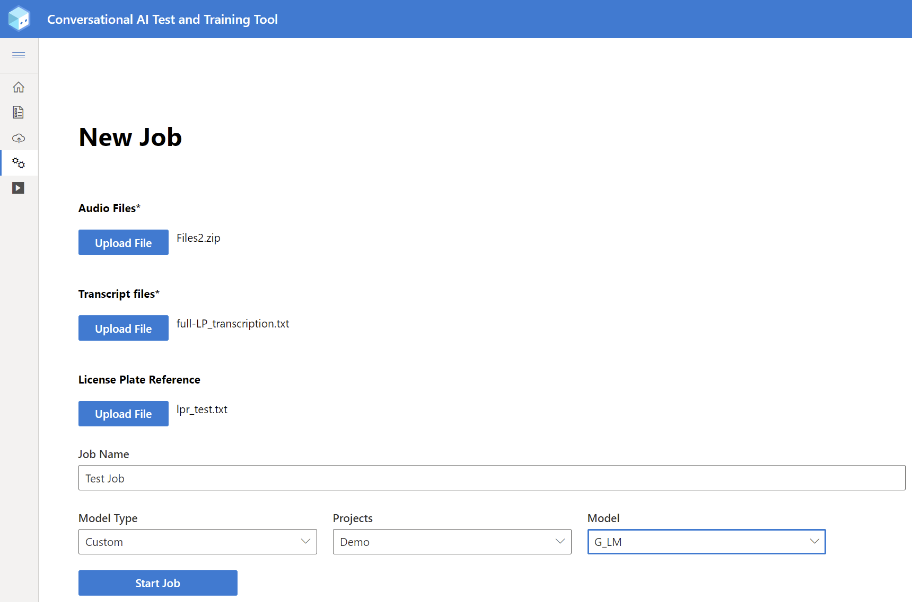
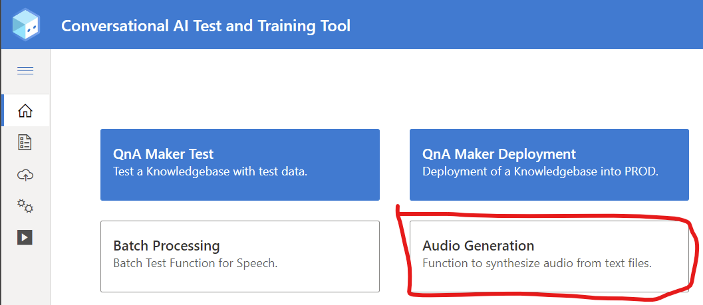
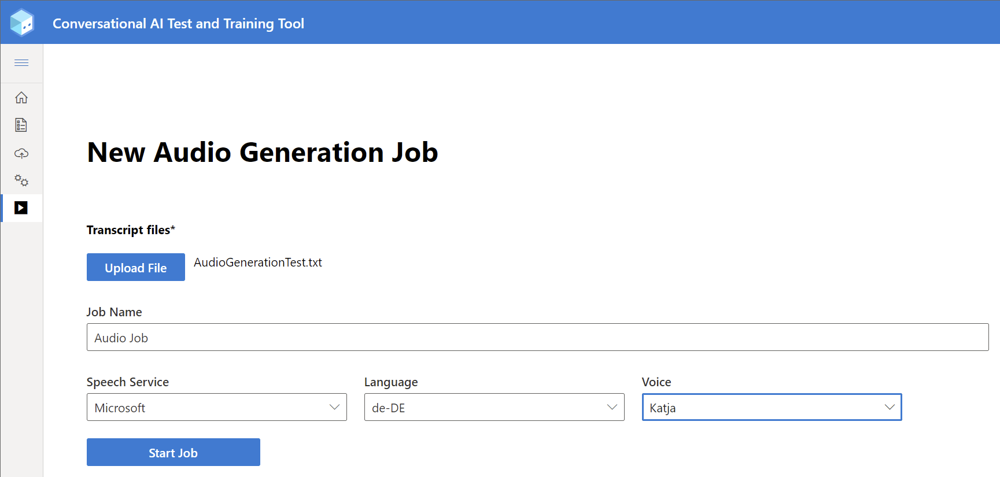
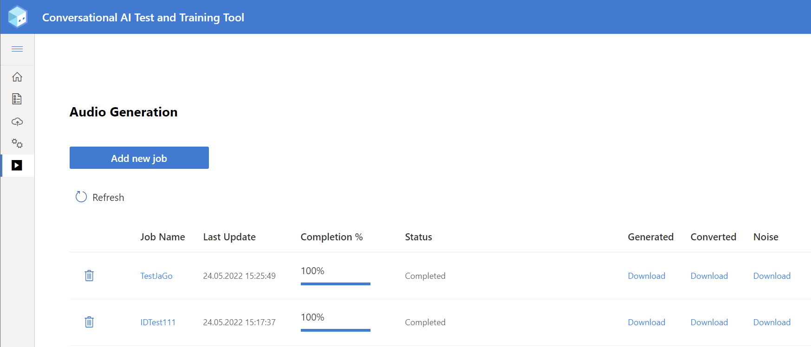
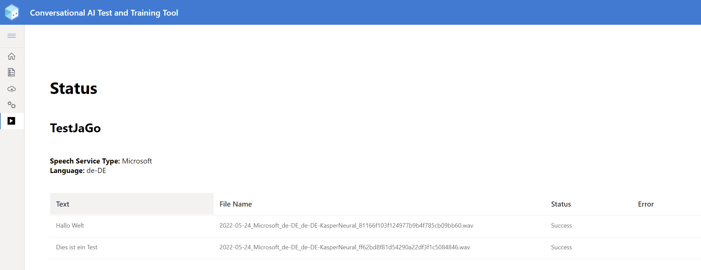

# Table of contents
1. [QnA Maker Testing & Deployment](#QnATest+Deploy)
    1. [QnA Maker Testset](#Testset)
        1. [Testing a KB](#TestingKB)
            1. [Result Details](#TestingResults)
        1. [Deploying a new KB](#DeployingKB)
            1. [Result Details](#DeploymentResults)
1. [Speech Testing](#SpeechTesting)
    1. [Batch Testing](#SpeechBatchTesting)
        1. [Generate a testset](#SpeechBatchTestingGenerate)
        1. [Running a Batchtest](#SpeechBatchTestingRunTest)
        1. [Result Details](#SpeechBatchTestingResults)
    1. [Audio Generation](#SpeechAudioGeneration)
        1. [Generate transcript](#SpeechAudioGenerationGenerate)
        1. [### Create Job](#SpeechAudioGenerationAddJob)
        1. [Download files & Check Status](#SpeechAudioGenerationDownload)

# QnA Maker Testing & Deployment 

## QnA Maker Testset 

The testset must be a textfile (.txt) with the following structure:

*Question;Answer;Metadata;IsContextOnly;Propmts;QnAId;MinScore*

The 1st line can be any Text and can also be used for comments. This line is ignored in the testing process.

Prompts and MinScore columns are optional. The values are optional, however you must have the colum separation with ";" in the file. MinScore is used to define an optional Confidence Score for the answer.

Example: [Testset_Sample.txt](assets/samples/Testset_Sample.txt)

### Generate a testset from existing knowledge base 

To create a testset based on an existing knowledge base you can use the export functionality of the QnA maker:
1. Go to https://www.qnamaker.ai/ and select the knowledge base you want to use for the testset
2. Go to the settings page, under "Export knowledge base" select "QnAs" and export the knowledge base as Excel file
3. Open the downloaded file in Excel
4. Delete the "Source" and the "SuggestedQuestions" column
5. Add a last column "MinScore" and enter a value between 0 and 100 for each entry
6. Save the file as Text (tab delimited)
7. Replace the tabs with a simicolon. You can do so using Text Editors like notepad++ using Find and Replace option using regular expressions. (Find: "\t", Replace: ";")

Make sure you only include important questions in your testset so you don't exceed 150 testcases. Otherwise the execution time will be long and the results harder to debug.

## Testing a KB 

To test a knowledge base go to the QnA testing page of the tool:

1. Select an environment that contains the knowledge base you want to test.
2. Then you can chose the knowledge base you want to test
3. Upload a test file. Make sure it is compliant to the format described above.
4. If the format check of the test file was successful, you can start the test run by clicking the start button on the bottom of the page.
5. A new entry is created on the test overview page

### Result Details 

To view the results of your tests you can open the details page after the test run is complete by clicking on the job id of the test run:

## Deploying a new KB 

To run a deployment of a QnAMaker KB into Production you cav use the [Bot Management Tool](https://app-goblabla-botmanagement-uat.azurewebsites.net/deploy-initial). 

After logging in to the tool navigate to the "QnA Maker Deployment" section

Select "New Deployment"

Select a Knowledge Base from the Drop-Down-List and upload a file with your testcases. The knowledge base should be tested with the same test set using the QnA Test section before.

You can add an optional comment. Then select "Start Deployment".
    
For the deployment only a certain percantage of the test cases defined in the testset is executed. This value is configured in the app settings of the tool.

The new deployment will appear in the "QnA Deployment" section list with status "In progress":

### Result Details 

To view the results of your deployment tests you can open a detailed view after the deployment is complete by clicking on the job id.

# Speech Testing 

## Batch Testing 
### Generate a testset 
To use the Batch Testing you need three datasets:
- Audio Files: Zip file containing your audio files (without any folder structure inside)
- Transcript Files: UTF-8-BOM text file with a line per audio file with the following structure:

    | Name of Audiofile | Transcript of Audiofile |
    |--|--|
    | file1.wav	| Mein Name ist Müller |
    | file2.wav | Ich würde gerne in die Filiale nach Bremen |

- License plate Reference: Optional for License Plate Accouracy Testing: UTF-8 text file with a line per audio file with the following structure:

    | Name of Audiofile | Expected License Plate |
    |--|--|
    | file1.wav	| HB-RT801 |
    | file2.wav | B-SP779 |

### Running a Batchtest 

To run a batch test go to the Batch Processing page of the tool:

1. Press "Add new test" to open the test creation wizard.
1. Select the three files from you testset.
1. Define a *Job Name*.
1. Select the model you want to use (base line or custom model) via the dropdown fields.
1. Press "Start Job".
1. A new entry is created on the test overview page

### Result Details 
To view the results of your tests you can open the details page after the test run is complete by clicking on the job id of the test run.

## Audio Generation 
The Audio Generation feature enables batch synthesization of Text-to-Speech Audio to create datasets or audio assets.

### Generate transcript 
To use the Audio Gernation you need to create a transcript File containing the utterances.
You need to create UTF-8 text file with a line per audio file containing the text incl. SSML you want to synthesize.

### Create Job 
To create a new Audio Generation Job go to the Audio Generation page of the tool:

1. Press "Add new job" to open the job creation wizard.
1. Select thethe transcript of the utterances you want to synthesize.
1. Define a *Job Name*.
1. Select the speech service you want to use (depends on which services you configured in your appsettings!) via the dropdown field.
1. Select the language and voice you want to use for your job.
1. Press "Start Job".
1. A new entry is created on the job overview page

### Download files & Check Status
The tool creates three different qualities of the synthesized files:
1. High Quality
1. Low Quality
1. Noise mixed into the audio

You can download the different datasets (audio incl. transcript) via the download links provided for each job.

To check the details of a job you can click on the job id to open the details page.

