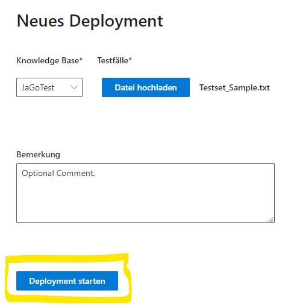

***DRAFT!!!***

# Table of contents
1. [QnA Maker Testing & Deployment](#QnATest+Deploy)
    1. [QnA Maker Testset](#Testset)
        1. [Testing a KB](#TestingKB)
            1. [Result Details](#TestingResults)
        1. [Deploying a new KB](#DeployingKB)
            1. [Result Details](#DeploymentResults)
1. [Speech Testing](#SpeechTesting)

# QnA Maker Testing & Deployment 

## QnA Maker Testset 

The testset must be a textfile (.txt) with the following structure:

*Question;Answer;Metadata;IsContextOnly;Propmts;QnAId;MinScore*

The 1st line can be any Text and can also be used for comments. This line is ignored in the testing process.

Prompts and MinScore columns are optional. The values are optional, however you must have the colum separation with ";" in the file. MinScore is used to define an optional Confidence Score for the answer.

Example: [Testset_Sample.txt](assets/samples/Testset_Sample.txt)

### Generate a testset from existing knowledge base 

To create a testset based on an existing knowledge base you can use the export functionality of the QnA maker:
1. Go to https://www.qnamaker.ai/ and select the knowledge base you want to use for the testset
2. Go to the settings page, under "Export knowledge base" select "QnAs" and export the knowledge base as Excel file
3. Open the downloaded file in Excel
4. Delete the "Source" and the "SuggestedQuestions" column
5. Add a last column "MinScore" and enter a value between 0 and 100 for each entry
6. Save the file as Text (tab delimited)
7. Replace the tabs with a simicolon. You can do so using Text Editors like notepad++ using Find and Replace option using regular expressions. (Find: "\t", Replace: ";")

Make sure you only include important questions in your testset so you don't exceed 150 testcases. Otherwise the execution time will be long and the results harder to debug.

## Testing a KB 

To test a knowledge base go to the QnA testing page of the tool:

1. Select an environment that contains the knowledge base you want to test. The environment name and connection key can be configured in the .env file of the project. E.g. QNA_ENV = ["TEST", "DEV"] and QNA_KEY = ["<key_for_TEST>", "key_for_DEV"] 
2. Then you can chose the knowledge base you want to test
3. Upload a test file. Make sure it is compliant to the format described above.
4. If the format check of the test file was successful, you can start the test run by clicking the start button on the bottom of the page.
5. A new entry is created on the test overview page

### Result Details 

To view the results of your tests you can open the details page after the test run is complete by clicking on the job id of the test run:

## Deploying a new KB 

To run a deployment of a QnAMaker KB into Production you must use the [Bot Management Tool](https://app-goblabla-botmanagement-uat.azurewebsites.net/deploy-initial).

After logging in to the tool navigate to the "QnA Maker Deployment" section

Select "Neues Deployment"

Select a Knowledge Base from the Drop-Down-List and upload a file with your testcases.

You can add an optional comment. Then select "Deployment Starten"

The new deployment will appear in the "QnA Deployment" section list with status "Angenommen":

### Result Details 

To view the results of your deployment tests you can open the "Detailansicht" after the deployment is complete.

# Speech Testing 

TBD!
