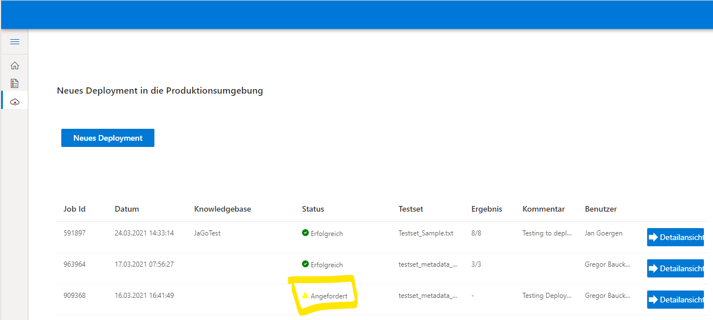

***DRAFT!!!***

# Table of contents
1. [QnA Maker Testing & Deployment](#QnATest+Deploy)
    1. [QnA Maker Testset](#Testset)
        1. [Testing a KB](#TestingKB)
            1. [Result Details](#TestingResults)
        1. [Deploying a new KB](#DeployingKB)
            1. [Result Details](#DeploymentResults)
1. [Speech Testing](#SpeechTesting)

# QnA Maker Testing & Deployment 

## QnA Maker Testset 

The testset must be a textfile (.txt) with the following structure:

*Question;Answer;Metadata;IsContextOnly;Propmts;QnAId;MinScore*

The 1st line can be any Text and can also be used for comments.

Prompts and MinScore columns are optional. The values are optional, however you must have the colum separation with ";" in the file. MinScore is used to define an optional Confidence Score for the answer.

Example: [Testset_Sample.txt](assets/samples/Testset_Sample.txt)

## Testing a KB 

TBD!

### Result Details 

To view the results of your tests you can open the "Detailansicht" after the test run is complete.

## Deploying a new KB 

To run a deployment of a QnAMaker KB into Production you must use the [Bot Management Tool](https://app-goblabla-botmanagement-uat.azurewebsites.net/deploy-initial).

After logging in to the tool navigate to the "QnA Maker Deployment" section

Select "Neues Deployment"

Select a Knowledge Base from the Drop-Down-List and upload a file with your testcases.

You can add an optional comment. Then select "Deployment Starten"

The new deployment will appear in the "QnA Deployment" section list with status "Angenommen":

### Result Details 

To view the results of your deployment tests you can open the "Detailansicht" after the deployment is complete.

# Speech Testing 

TBD!
